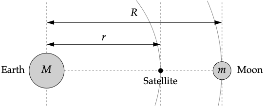

# 项目2：拉格朗日点

## 项目介绍

拉格朗日点是天体力学中的特殊位置，在这些点上，小质量天体可以相对于两个大质量天体保持静止。在地球-月球系统中，L1拉格朗日点位于地球和月球之间，是一个特别重要的位置，因为放置在这里的卫星可以同时观测地球和月球，并且保持相对静止的位置。

在本项目中，我们将通过数值方法求解地球-月球系统中L1拉格朗日点的位置。这个问题涉及到求解一个高次多项式方程，需要使用迭代法（如切线法或弦截法）来获得高精度的数值解。

## 项目任务

1. **理论推导**：
   并假设地球比月亮和卫星的质量大得多, 请说明从地心到$L_1$点的距离$r$满足
	$$\frac{GM}{r^2}-\frac{Gm}{(R-r)^2}=\omega^2r, $$
   其中$M$和$m$分别是地球和月亮的质量, $G$是万有引力常数, $\omega$是月亮和卫星的角速度.

2. **数值求解**：
   - 使用切线法（牛顿法）或弦截法求解L1点的位置r
   - 解的精度要求至少达到4位有效数字
   - 如果使用切线法，需要选择合适的初值；如果使用弦截法，需要选择合适的初始区间

3. **验证结果**：
   - 使用SciPy库中的fsolve()函数求解同一方程
   - 比较自己实现的方法与fsolve()的结果，分析差异

## 常数值

计算中需要使用以下常数：

- 万有引力常数：G = 6.674×10^(-11) m^3·kg^(-1)·s^(-2)
- 地球质量：M = 5.974×10^24 kg
- 月球质量：m = 7.348×10^22 kg
- 地月距离：R = 3.844×10^8 m
- 月球角速度：ω = 2.662×10^(-6) s^(-1)

## 提示与资源

1. **方程推导**：
   - 考虑在L1点的卫星受到的地球引力、月球引力以及离心力
   - 在L1点，这些力必须平衡，才能使卫星保持相对静止

2. **数值方法选择**：
   - 切线法（牛顿法）收敛速度快，但需要计算导数，且对初值选择敏感
   - 弦截法不需要计算导数，对初值要求较低，但收敛速度稍慢
   - 对于初值选择，可以考虑L1点应该位于地球和月球之间，且更靠近月球

3. **实现建议**：
   - 在实现数值方法时，设置合理的终止条件（如相对误差小于10^(-8)）
   - 为避免数值溢出，可以对方程进行适当的数学变换
   - 使用fsolve()时，需要提供一个合理的初始猜测值